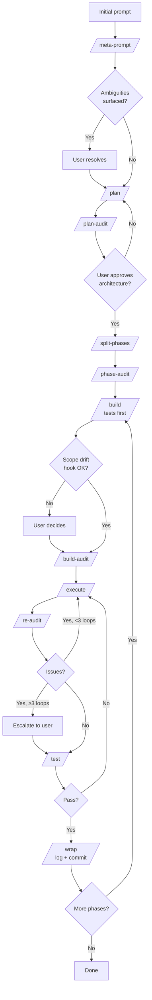

# claude-chaperone

[](LICENSE)  

> A structured workflow for Claude Code sessions, optimized for output quality over token count.

A folder you copy into a project to force Claude Code through a structured build flow: plan first, split into phases, test, audit its own diff, commit, move on. Twelve slash commands, three Python hooks (stdlib only, no install), one skill that ties them together.

| Who | Does what |
|---|---|
| **You** | Make the architecture calls, approve the plan, `/clear` between stages |
| **Claude** | The mechanical work: test-first, inside a declared scope, with the diff audited before you see it |

> [!NOTE]
> Dormant unless `plan/current_phase.txt` exists in the project. Dropping the folder into a repo changes nothing until you actually start a phase.

---

## Why this exists

Long sessions are brittle. Every failure mode below has a mechanism in this repo that catches it:

| Problem | What it looks like | What handles it |
|---|---|---|
| **Context rot** | Quality slides as the conversation fills up | `/clear` between every stage |
| **Scope drift** | "Helpful" edits to code you didn't ask about | `scope_drift_check.py` + declared `phase_scope.json` |
| **Self-audit blind spots** | Reviewing its own work, it misses the same things twice | `/build-audit` runs in a fresh context |
| **Lost state** | New session guesses where the last one stopped | `/handoff` + `BUILD_LOG.md` |
| **Infinite polish** | Audit, fix, audit, fix, with no exit | `/re-audit` caps at 3 loops |
| **Forgotten discipline** | Build logs, commits, handoffs skipped by accident | `/wrap` + `build_log_reminder.py` |

## What's in it

Three parallel pieces. Each carries its own weight; you can disable any of them without breaking the others.

### <a href="#whats-in-it"></a>

*12 slash commands · one per stage.* `/clear` between them so each runs in a fresh context.

```
/meta-prompt  →  /plan  →  /plan-audit  →  /split-phases  →  /phase-audit
                                                                   ↓
             /wrap  ←  /test  ←  /re-audit  ←  /execute  ←  /build-audit  ←  /build
```

### <a href="#whats-in-it"></a>

*3 Python scripts · stdlib only · zero install.*

| Hook | Fires on | What it does |
|---|---|---|
| `scope_drift_check.py` | End of turn | Warns if edits left the phase scope |
| `push_confirm.py` | `git push` | Forces a permission prompt |
| `build_log_reminder.py` | User prompt | Nags when code changes outrun `BUILD_LOG.md` |

### <a href="#whats-in-it"></a>

*1 orchestrator · auto-triggers the sequence.* Pulls you through the full flow on phrases like `new feature`, `build phase`, `audit`, or `wrap up` — no need to remember which command comes next.

---

## Requirements

- [Claude Code](https://claude.com/claude-code) installed. v2.1.85 or later recommended (earlier versions work — hooks just fire slightly more often than needed).
- Python 3.8 or later on `PATH`. The hooks are stdlib only, nothing to `pip install`.
- macOS, Linux, or Windows.

Optional: `codex`, `gemini`, or `aider` on `PATH` for second-opinion audits. If none are present, audits fall back to an isolated subagent (same model, fresh context).

> [!WARNING]
> Built for multi-phase work. If your task is a typo fix or a single-file change, skip this process.

## Quick start

```bash
# 0. Clone the repo
git clone https://github.com/micronwave/claude-chaperone.git

# 1. Copy the .claude/ folder into your project (merge if one already exists)
cp -r claude-chaperone/.claude your-project/

# 2. Merge settings.json into your project's .claude/settings.json.
#    If you don't already have one, just copy it:
#       cp claude-chaperone/settings.json your-project/.claude/settings.json
#    If you do, append each entry under its hookEventName array — don't
#    replace the whole hooks object, or you'll clobber your existing hooks.

# 3. Paste the CLAUDE.md.snippet contents into your project's CLAUDE.md

# 4. Verify the hooks work on your machine (22 tests, stdlib only)
cd your-project && python .claude/hooks/test_hooks.py

# 5. Start a fresh Claude Code session
/meta-prompt "rough idea of what you want to build"
```

---

## Using it

The skill auto-triggers on phrases like "new feature", "build phase", "audit", or "wrap up" — so in most sessions you just talk to Claude and it pulls you through the stages. If you want to drive manually, the slash commands map one-to-one onto the flow:

1. **Kick off:** `/meta-prompt "rough idea"`. Claude expands it into a spec and surfaces ambiguities. You answer them in the same turn.

   `/clear`

2. **Plan:** `/plan`. Claude writes a plan file.

   `/clear`

3. **Plan audit:** `/plan-audit`. A fresh context reviews it. You approve the architecture, or loop back to step 2.

   `/clear`

4. **Split:** `/split-phases`. The plan becomes one file per phase, each sized for a single session.

   `/clear`

5. **Phase audit:** `/phase-audit` checks the split.

   `/clear`

6. **Build:** `/build` — tests first, then implementation.

   `/clear`

7. **Audit the diff:** `/build-audit` (diff-scoped, produces `audit_fix.md`), then `/execute` applies every fix.

   `/clear`

8. **Re-audit, test, ship:** `/re-audit` (caps at 3 loops) → `/test` → `/wrap` (appends to `BUILD_LOG.md`, commits locally, never pushes).

9. **Pause anytime:** `/handoff` writes a self-contained state file so the next session picks up cleanly.

Each command ends by telling you the exact next one to run, so in practice it's one keystroke per gate.

> [!IMPORTANT]
> Don't skip the `/clear` calls. They wipe Claude's memory of the last stage so the next one runs in a fresh context. This is the single biggest quality mechanism in the workflow.

**What the hooks do in the background:** warn on scope drift at end of turn, require a click on `git push`, nag if `BUILD_LOG.md` falls behind the code.

<details>
<summary><b>What a real session looks like</b></summary>

<br>

Abbreviated transcript of the first two stages for "add a dark mode toggle":

**You:** `/meta-prompt "add a dark mode toggle to the settings page"`

**Claude:** Before I can plan this, a few things need nailing down:
1. Persistence — system preference, `localStorage`, or user profile in DB?
2. Scope — just the settings page, or all routes?
3. Default on first visit — follow system, or light mode?

**You:** 1) localStorage. 2) All routes. 3) Follow system.
**You:** `/clear`
**You:** `/plan`

**Claude:** *(writes `plan/plan.md` — architecture, files to touch, phase breakdown, test list)*

Plan written. Two phases:
1. ThemeProvider + useTheme hook
2. Settings-page toggle + persistence

Next: `/clear`, then `/plan-audit`.

</details>

---

## Flow

Every stage transition runs `/clear` first to drop stale context — omitted from the diagram for readability.

<details>
<summary></summary>

<br>



</details>

## Rules

1. A phase fits one session, or it gets split.
2. `/clear` between every stage. Stale context is the #1 quality killer.
3. State lives in handoff files, not conversation memory.
4. Audits are scope-bounded, but within scope nothing gets sampled.
5. Re-fix loops cap at 3. After that, the human gets pulled back in.
6. You own architecture. Claude owns execution.
7. `git push` always needs a human click. No auto-push, ever.
8. Second-opinion tools (`codex`, `gemini`, `aider`) are welcome but optional. If none are on `PATH`, audits fall back to a fresh subagent.

The reasoning behind each lives in [`docs/WORKFLOW.md`](docs/WORKFLOW.md).

---

## Further reading

- [`docs/AUTOMATION.md`](docs/AUTOMATION.md) — what's automated, what isn't, and why
- [`docs/SECOND_OPINION.md`](docs/SECOND_OPINION.md) — integrating `codex`, `gemini`, or `aider` for audits

---

## License

MIT. See `LICENSE`.
