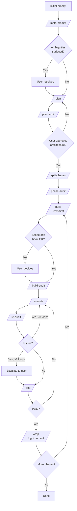

# claude-chaperone

[](LICENSE)  

> A structured workflow for Claude Code sessions, optimized for output quality over token count.

A one-line install (`curl | python`) that drops a structured build flow into any Claude Code project: plan first, split into phases, test, audit its own diff, commit, move on. Twelve slash commands, four Python hooks (stdlib only, no install), one skill that ties them together.

**You** make the architecture calls, approve the plan, `/clear` between stages.
**Claude** does the mechanical work, test-first, inside a declared scope, with the diff audited before you see it.

> [!NOTE]
> Dormant unless the workflow is active (`plan/current_phase.txt` exists, or pre-phase plan files are present without a `plan/workflow_complete.txt` marker). Dropping the folder into a repo changes nothing until you actually start a workflow.

---

## Why this exists

Long sessions are brittle:

| Problem | What it looks like |
|---|---|
| Context rot | Quality slides as the conversation fills up |
| Scope drift | "Helpful" edits to code you didn't ask about |
| Self-audit blind spots | Reviewing its own work, it misses the same things twice |
| Lost state | New session guesses where the last one stopped |
| Infinite polish | Audit, fix, audit, fix, with no exit |
| Forgotten discipline | Build logs, commits, handoffs skipped by accident |

This repo has an answer for each.

## What's in it

**Twelve slash commands**, one per stage. You `/clear` between them so each runs in a fresh context *(plus an optional `/chaperone` entry-point router — not shown)*:

```
/meta-prompt  →  /plan  →  /plan-audit  →  /split-phases  →  /phase-audit
                                                                   ↓
             /wrap  ←  /test  ←  /re-audit  ←  /execute  ←  /build-audit  ←  /build
```

**Four hooks**, pure Python stdlib, no install step:

- `scope_drift_check.py` warns at end of turn if edits left the phase scope
- `push_confirm.py` forces a permission prompt on `git push`
- `build_log_reminder.py` nags when code changes have outrun `BUILD_LOG.md`
- `session_start.py` injects the current workflow state after `/clear` so Claude picks up where you left off

**One skill** that auto-triggers the whole sequence on phrases like "new feature", "build phase", "audit", or "wrap up".

> [!NOTE]
> After every `/clear`, the session-start hook auto-injects a snapshot (current phase, last `BUILD_LOG.md` entry, `plan/` artifact inventory, re-audit loop counter, suggested next command) into Claude's context. You don't need to re-brief after a clear — just paste the next slash command.

---

## Requirements

- [Claude Code](https://claude.com/claude-code) installed. v2.1.85 or later recommended (earlier versions work — hooks just fire slightly more often than needed).
- Python 3.8 or later on `PATH`. The hooks are stdlib only, nothing to `pip install`.
- macOS, Linux, or Windows.

Optional: `codex`, `gemini`, or `aider` on `PATH` for second-opinion audits. If none are present, audits fall back to an isolated subagent (same model, fresh context).

> [!WARNING]
> Built for multi-phase work. If your task is a typo fix or a single-file change, skip this process.

## Quick start

One-line install into your project:

```bash
curl -sSL https://raw.githubusercontent.com/micronwave/claude-chaperone/main/install.py | python - --target .
```

Or from a clone:

```bash
git clone https://github.com/micronwave/claude-chaperone.git
python claude-chaperone/install.py --target /path/to/your-project
```

The installer merges `settings.json` without clobbering existing hooks, appends a marker block to `CLAUDE.md`, copies commands / hooks / skill files, and runs the 43-test hook suite to verify. Idempotent — safe to re-run (validates existing installs without clobbering). Use `--force` to overwrite divergent chaperone-owned files when upgrading.

Then, in a fresh Claude Code session inside your project:

```
/chaperone "rough idea of what you want to build"
```

`/chaperone` is the single memorable entry point. With an idea it launches the workflow; without arguments it reports where you are and what to run next.

<details>
<summary><b>Manual install (fallback)</b></summary>

<br>

If you want to see exactly what the installer does, or it fails on your system:

```bash
# 1. Clone
git clone https://github.com/micronwave/claude-chaperone.git

# 2. Copy the .claude/ folder into your project (merge if one already exists)
cp -r claude-chaperone/.claude your-project/

# 3. Merge settings.json. If you don't have one:
cp claude-chaperone/settings.json your-project/.claude/settings.json
# If you do, append each entry under its hookEventName array — don't
# replace the whole hooks object, or you'll clobber your existing hooks.

# 4. Paste CLAUDE.md.snippet into your project's CLAUDE.md

# 5. Verify hooks (43 tests, stdlib only)
cd your-project && python .claude/hooks/test_hooks.py
```

</details>

---

## Using it

The skill auto-triggers on phrases like "new feature", "build phase", "audit", or "wrap up" — so in most sessions you just talk to Claude and it pulls you through the stages. If you want to drive manually, the slash commands map one-to-one onto the flow:

1. **Kick off:** `/chaperone "your idea"` (or `/meta-prompt "your idea"` if you want to skip the router). Claude expands it into a spec and surfaces ambiguities. You answer them in the same turn.

   `/clear`

2. **Plan:** `/plan`. Claude writes a plan file.

   `/clear`

3. **Plan audit:** `/plan-audit`. A fresh context reviews it. You approve the architecture, or loop back to step 2.

   `/clear`

4. **Split:** `/split-phases`. The plan becomes one file per phase, each sized for a single session.

   `/clear`

5. **Phase audit:** `/phase-audit` checks the split, verifies integrity.

   `/clear`

6. **Build:** `/build` — tests first, then implementation.

   `/clear`

7. **Audit the diff:** `/build-audit` (diff-scoped, produces `audit_fix.md`), then `/execute` applies every fix.

   `/clear`

8. **Re-audit, test, ship:** `/re-audit` (caps at 3 loops) → `/test` → `/wrap` (appends to `BUILD_LOG.md`, commits locally, never pushes).

9. **Pause anytime:** `/handoff` writes a self-contained state file so the next session picks up cleanly.

Each command ends by telling you the exact next one to run, so in practice it's one keystroke per gate.

> **Lost mid-workflow?** Run `/chaperone` with no arguments. It reads `plan/current_phase.txt`, shows your current state, and tells you the next command to run. It's deliberately a read-only router — it never auto-advances.

> [!IMPORTANT]
> Don't skip the `/clear` calls. They wipe Claude's memory of the last stage so the next one runs in a fresh context. This is the single biggest quality mechanism in the workflow.

**What the hooks do in the background:** warn on scope drift at end of turn, require a click on `git push`, nag if `BUILD_LOG.md` falls behind the code, and inject the current workflow state after every `/clear` so Claude doesn't need re-briefing.

<details>
<summary><b>What a real session looks like</b></summary>

<br>

Abbreviated transcript of the first two stages for "add a dark mode toggle":

**You:** `/meta-prompt "add a dark mode toggle to the settings page"`

**Claude:** Before I can plan this, a few things need nailing down:
1. Persistence — system preference, `localStorage`, or user profile in DB?
2. Scope — just the settings page, or all routes?
3. Default on first visit — follow system, or light mode?

**You:** 1) localStorage. 2) All routes. 3) Follow system.
**You:** `/clear`
**You:** `/plan`

**Claude:** *(writes `plan/plan.md` — architecture, files to touch, phase breakdown, test list)*

Plan written. Two phases:
1. ThemeProvider + useTheme hook
2. Settings-page toggle + persistence

Next: `/clear`, then `/plan-audit`.

</details>

---

## Flow

Every stage transition runs `/clear` first to drop stale context — omitted from the diagram for readability.

*(`/chaperone` is an optional entry point — not shown.)*



## Repo layout

```
claude-chaperone/
├── README.md
├── CLAUDE.md.snippet              ← paste into your project's CLAUDE.md
├── settings.json                  ← hooks registration
├── docs/
│   ├── WORKFLOW.md                ← full rationale + gate definitions
│   ├── AUTOMATION.md              ← what is and isn't automated, and why
│   └── SECOND_OPINION.md          ← optional external-tool integration
└── .claude/
    ├── skills/full-build-workflow/
    │   ├── SKILL.md               ← orchestration + keyword triggers
    │   └── references/
    │       ├── templates/         ← plan, handoff, audit_fix, build_log
    │       └── prompts/           ← reusable prompt fragments
    ├── commands/                  ← the 12 workflow commands + /chaperone router
    └── hooks/                     ← scope-drift, push-confirm, log-nag, session-start
```

## Rules

1. A phase fits one session, or it gets split.
2. `/clear` between every stage. Stale context is the #1 quality killer.
3. State lives in handoff files, not conversation memory.
4. Audits are scope-bounded, but within scope nothing gets sampled.
5. Re-fix loops cap at 3. After that, the human gets pulled back in.
6. You own architecture. Claude owns execution.
7. `git push` always needs a human click. No auto-push, ever.
8. Second-opinion tools (`codex`, `gemini`, `aider`) are welcome but optional. If none are on `PATH`, audits fall back to a fresh subagent.

The reasoning behind each lives in [`docs/WORKFLOW.md`](docs/WORKFLOW.md).

---

## Further reading

- [`docs/AUTOMATION.md`](docs/AUTOMATION.md) — what's automated, what isn't, and why
- [`docs/SECOND_OPINION.md`](docs/SECOND_OPINION.md) — integrating `codex`, `gemini`, or `aider` for audits

---

## License

MIT. See `LICENSE`.
